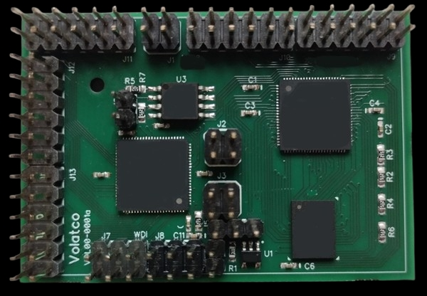
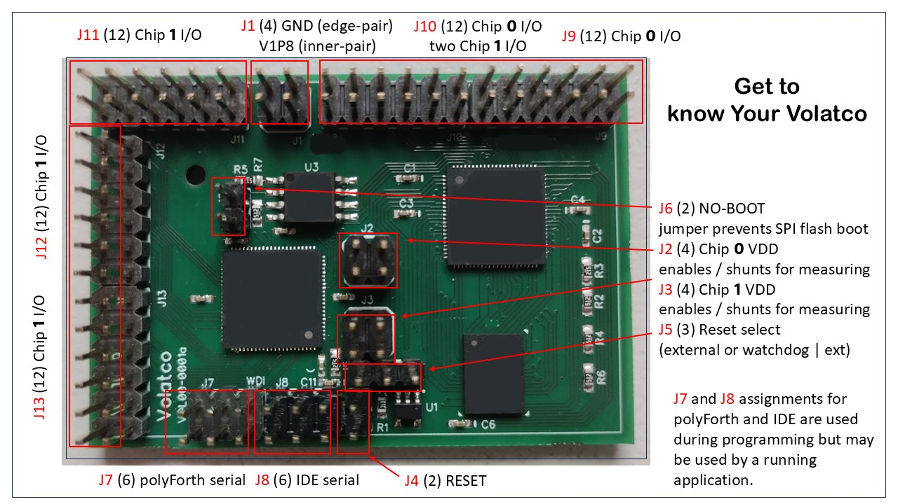

## Volatco

The most powerful environmentally-friendly multicomputer.

### Introducing Volatco

The first widely-aailable multicomputer and multiprogrammer for machine-intelligent ideal applications in a compact 6 cm x 4 cm x 1.5 cm form-factor.

**Why Volatco?**

Artificial‑intelligence research is no longer confined to massive datacenter farms. To explore **embodied AI, neuromorphic experimentation, and ultra‑low‑energy inference**, we need hardware that is **massively parallel, energy‑frugal, and easily extensible**.

The **Volatco multicomputer** packs **two GA144A12 mesh‑processor chips**, **16 MB of SRAM**, **16 MB of SPI flash**, and a flexible off‑board I/O architecture into a board **smaller than a credit card** that draws **only milliwatts of power when idle**.

**Accessories:** Dedicated power, Ethernet, BLE: Volatco has them!

**polyForth:** On-board operating system that is lightweight, dual-stack operating system and programming environment.

**Bottom line:** Volatco gives you a full‑blown AI quantum-compute node.

**Key Features**

| **Feature** | **Benefit** |
| --- | --- |
| **Dual GA144A12 Cores (144 × 2 = 288 cores)** | Run 288 concurrent threads -ideal for parallel algorithms, machine-intelligence, and evolutionary computing. |
| **polyForth® Runtime** | A lightweight, stack‑based language that lets you prototype, debug, and iterate on AI kernels in minutes-no heavyweight SDKs required. |
| **16 MB SRAM + 16 MB SPI Flash** | Fast volatile memory for model parameters and large non‑volatile storage for firmware, datasets, and compiled Forth programs. |
| **Zero On‑Board Regulation** | Power is supplied externally, eliminating regulator quiescent draw and shrinking the PCB. Choose the most efficient supply for your experiment. |
| **Rich Off‑Board I/O** | All GPIO, analogue‑in/out, and power pins are exposed on a standard breadboard‑compatible header. Plug in sensors, actuators, or custom expansion boards without soldering. |
| **Watchdog & Reset Circuitry** | Automatic recovery from software hangs, essential for long‑running experiments. |
| **Modular Expansion Row** | Connect external power modules, additional memory, Bluetooth, Ethernet, or bespoke I/O boards via header rows. |
| **Compact Form Factor** | Designed to fit into tight enclosures, drone payload bays, or multi‑board racks for scalable clusters. |

**Who Is Volatco For?**

- **Academic & industry researchers** exploring new AI architectures, spiking networks, or energy‑aware machine learning.
- **Hardware hackers & makers** who want a hands‑on platform for autonomous robots, sensor‑fusion nodes, or edge‑AI devices.
- **Educators & students** seeking a tangible, low‑cost system to teach parallel computing and low‑power design principles.
- **Start‑ups & prototypers** needing a ready‑made, asynchronous AI engine that can be integrated into products without additional licensing fees.

In the following pages, the details of the Volatco board will be described.

### The Volatco pin-set

All connections are made on the top of the PCB. The model 'c' dialect has pins out both the top and bottom of the board.

#### Option Jumpers

*	`J6` is "No boot". Insert to prevent `chip 0` from booting SPI flash on reset.
*	`J5` selects development mode (pins 1 and 2 jumpered) or production (pins 2 and 3). In the latter case the watchdog/reset circuit is enabled. Development mode is required whenever "No boot" is installed.
*	`J4` is shorted to produce a manual reset. This may also be done by the system providing IDE service through `J8`. Either of these reset methods works in either development or production mode.

#### Connection Headers

*	`J1` is external power and ground input.
*	`J8` is for serial IDE input (including reset).
*	`J7` is for polyFORTH terminal input - including watchdog signal, normally supplied from on the board. Both `J7` and `J8` carry both ground and `V1P8` for devices such as FTDI chips that can accept our supply to power their I/O pins.
*	`J9` and `J10` are signals from chip 0 plus two pins from chip 1. `J11`, `J12`, and `J13` all carry signals from `chip 1`. Each of these 12-pin headers carries 9 signals and 3 grounds, for a total of 45 signals. See following table for the pinout description.

##### Power control

| External 1V8 input |   | J1 |   |      |
|:------------------:|:-:|:--:|:-:|:----:|
|         GND        | 1 |    | 2 | V1P8 |
|         GND        | 3 |    | 4 | V1P8 |

Note that the ground pins are those nearest the PCB edge.

| Chip 0 (Host) shunts |   | J2 |   |          |
|:--------------------:|:-:|:--:|:-:|:--------:|
|         V1P8         | 1 |    | 2 | VC0-Core |
|         V1P8         | 3 |    | 4 |  VC0-I/O |

Jumpers are shown for normal operation. Substitute a shunt resistor to measure voltage drop across the resistor and calculate current. Be sure to use a small enough value that the expected current will not cause a voltage drop setting the supply below specs for the chip (typically 1.62V).

| Chip 1 (Target) shunts |   | J3 |   |      |
|:----------------------:|:-:|:--:|:-:|:----:|
|        VC1-Core        | 1 |    | 2 | V1P8 |
|         VC1-I/O        | 3 |    | 4 | V1P8 |

Note that unlike `J2` the incoming supply is on the right side of this jumper block. The polarity of the drop will be reversed accordingly.

### Getting familiar with Volatco

