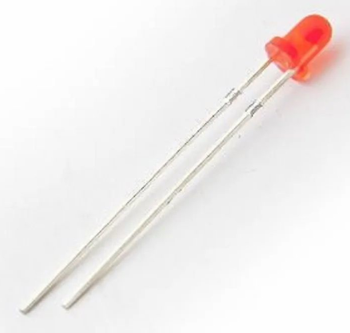

Welcome to the Volatco tutorials page. This section collects practical, hands-on guides for getting hardware connected, loading simple programs, and validating behavior on a real board.

# Tutorial Index

| Tutorial | Goal | Status |
| --- | --- | --- |
| Blink an LED with Volatco | Drive one GPIO line so an external LED turns on and off in a repeating pattern. | Available |

# Blink an LED with Volatco

This first tutorial is the classic hardware hello-world: make an LED blink from a Volatco GPIO signal.

## What You Will Need

- A Volatco board with power and programming access
- One mini-red LED with forward voltage `Vp = 2.0 V`
- One `550 ohm` current-limiting resistor
- Jumper wires
- A breadboard or another safe way to connect the LED
- A serial or IDE connection to the board



In most through-hole LEDs like this one, the longer lead is the anode and the shorter lead is the cathode.

## Parts Note

This tutorial is written around a `550 ohm` resistor and a mini-red LED with `Vp = 2.0 V`.

That combination is safe for a simple LED test, but there is one important caveat: LEDs respond to current, and the available current depends on the voltage headroom across the LED and resistor. Volatco GPIO behavior is documented around a `1.8 V` supply, so this mini-red `2.0 V` LED may not leave enough headroom for useful current to flow when driven directly from a GPIO pin. If the LED does not blink even though your program is running, the likely cause may be insufficient LED current rather than a bad connection.

For a guaranteed visible blink, use one of these approaches:

- Substitute an LED with a lower forward voltage.
- Drive the LED from a higher external rail through a transistor or buffer stage.
- Treat this first exercise as a logic-toggle test and verify the pin with measurement equipment before adding a driver stage.

## Before You Start

Use a simple development setup so the board is easy to control and recover:

- Set `J5` to development mode by connecting pins 1 and 2.
- Use `J4` for manual reset when needed.
- Use `J8` for IDE or serial development access.
- If you want to prevent SPI flash from auto-booting while experimenting, install `J6` and keep `J5` in development mode.

## Wiring the LED

For this tutorial, use documented GPIO `715.17`.

1. Locate the header position that exposes signal `715.17`.
2. Connect `715.17` to the `550 ohm` resistor.
3. Connect the resistor to the LED anode.
4. Connect the LED cathode to ground.

If you prefer to sink current instead of source it, reverse the LED-resistor order and adjust your program logic accordingly.

With the `550 ohm` resistor and mini-red `2.0 V` LED, the direct GPIO method is best treated as an experiment. It may work with some LEDs and setups, but it should not be assumed to provide enough current from a `1.8 V` GPIO swing.

`715.17` is documented in the published reference as a general-purpose `GPIO` signal. It is also noted there as a pin shared with nearby analog nodes, so keep this tutorial focused on a simple blink test and avoid attaching additional circuitry to that signal at the same time.

## Suggested First Test

For this tutorial, place the LED blink program into polyForth block `1585`.

That program should do three things:

1. Configure `715.17` as an output.
2. Drive it high, wait a short time, then drive it low.
3. Repeat forever.

In this example, the programmed blink interval is `2000` milliseconds per switch-state change, which is slow enough to verify easily by eye.

## Example Workflow

1. Power the board in development mode.
2. Connect your development interface through `J8`.
3. Enter or paste the LED blink polyForth code into block `1585`.
4. In arrayForth, type `1585 LOAD`.
5. Confirm that the command starts the program immediately.
6. Observe `715.17` changing state every `2000` milliseconds.
7. Confirm that the LED blinks steadily.

## Running the Program

Start the tutorial program from arrayForth with:

```text
1585 LOAD
```

This loads the code in block `1585` and starts it running.

## What Success Looks Like

You have completed this tutorial when:

- The LED blink code is stored in block `1585`.
- Typing `1585 LOAD` in arrayForth starts the program.
- `715.17` changes state every `2000` milliseconds.
- The LED blinks repeatedly without manual intervention.
- Resetting the board restarts the blink program cleanly.
- The board remains stable while the LED is connected.

## Demo Video

The short video below shows the LED blinking as described in this tutorial.

<figure>
  <video controls preload="metadata" style="width: 100%; max-width: 640px; height: auto;">
    <source src="../assets/volatco-gpio.mp4" type="video/mp4">
    Your browser does not support the video tag.
  </video>
  <figcaption>Volatco GPIO blinking a mini-red LED during the tutorial test.</figcaption>
</figure>

## Troubleshooting

If the LED does not blink:

- Verify LED polarity.
- Verify the `550 ohm` resistor is in series with the LED.
- Confirm you are really connected to documented signal `715.17`.
- Confirm the board is in development mode while testing.
- Confirm the code was entered into block `1585`.
- In arrayForth, run `1585 LOAD` again.
- Verify the blink interval in the code is `2000` milliseconds.
- Reset with `J4` and reload the program.
- Consider that the mini-red `2.0 V` LED on a `550 ohm` resistor may not receive enough current from a direct `1.8 V` GPIO output even when the pin is toggling correctly.

## Notes

- Keep this first exercise simple: one LED, one pin, one loop.
- Once this works, the next tutorials can build toward button input, timed events, and communication between nodes.
